<h1 align="center"> Active Directory Environment</h1>

<h2>Objective: </h2>
The purpose of this project is to demonstrate my skills in installing and configuring Windows Server and Windows Pro, as well as setting up an Active Directory and implementing various network services such as RAS NAT and DHCP. Through this project, I aim to provide clear and concise instructions on how to complete these tasks, making it easy for others to understand and follow. The goal is to inform and demonstrate my technical experience in the field of Windows server administration.

 
 
 
<h2> Table of Contents</h2>
  <ul style="font-size:10px">
      <li> Install Microsoft Server 2019 & Windows Pro (Virtual Box): *refer to InstallationGuide.md* </li>
      <li><a href="#Active"> Install Active Directory.</a> </li>
      <li><a href="#User"> User Creation Method 1 (GUI). </a> </li>
      <li><a href="#User2"> User Creation Method 2 (Powershell). </a></li>
      <li><a href="#User3"> User Creation Method 3 (Powershell Script).</a> </li>
      <li><a href="#Network"> Install DHCP and DNS Services- Private network.</a> </li>
      <li><a href="#Pro"> Windows Pro Client- Access Private Network @ Server</a> </li>
      <li><a href="#Scale"> Scaled Project </li>
  </ul>
 
 
<h2 id="Active"> Installing Active Directory </h2>
<ul>
  
  <li> Server Manager should automatically pop up. Click "Add roles and features"  </li>
  <li> at the Add roles window - click next until youu reach server roles and select "Active Directory Domain Services"  </li>
  <li> "Add Features"  </li>
  
  <li>Click "Next" and finsih installation  </li>
  <li> Follow the next pictures to AD post Deployment  </li>
   
   | 
  <li> After you hit next you will be prompted to add a password, then click next all the way through until you reach install  </li>
  <li> Your VM should automatically restart when finsihed </li>
</ul>
 
 
 
<h2 id="User"> Active Directory User Creation Method 1 of 3</h2>
<ul>
  <li> Your Windows Server has now been promoted to a Domain Controller with the intallation of Active directory. </li>
  
  <li> As you can see Active Directory (AD) has been allocated to Server manager. </li>
  <li> For user creation; proceed with Active Directory Users and Computers </li>
   
  <li> We will start m=by making two Organizational Units (OU's) "adadmin" & "adusers" </li>
   |  | 
   
  <li> We will start by adding a user to "ADadmin". </li>
  <li> At the ADamin OU Right-click=>New=>User </li>
  
 
  <li> The same process applied can be used for the Users OU </li>
  <li> ***NOTE: The Password policy is set to never expires, in production you would want to add a strong password policy*** </li>
 
  <li> Now lets give the user in our ADadmin OU administrator priveleges </li>
  <li> at user Right-click=>Properties=>Member-of=>Add </li>
  
  <li> Now you sign out of the administrator account and login with the admin account you created </li>
</ul>
 
 
 
<h2 id="User2"> Active Directory User Creation Method 2 of 3</h2>
<ul>
  <li>In this method we will use Power shell to create a user </li>
   |  | 
</ul>
 
 
 
<h2 id="User3"> Active Directory User Creation Method 3 of 3</h2>
 
</ul>
  <li> The last method is Automation with a Powershell Script </li>
  <li> This is geared towards an onboarding batch of more that 60 agents. Single agent creation will most likely be done through AD users and computers
  <li> Anywyas i will provide two script: First one is a non-secured script based of Jogn Matador. The second one is one that i made that is rudimental in nature but with no regard a more secure method of user creation.</li>
 
<h4> - Unsecure script </h4>
<pre>
$PASSWORD_FOR_USERS   = "Password1"
$USER_FIRST_LAST_LIST = Get-Content .\names.txt

$password = ConvertTo-SecureString $PASSWORD_FOR_USERS -AsPlainText -Force
New-ADOrganizationalUnit -Name ADUSERS -ProtectedFromAccidentalDeletion $false

foreach ($n in $USER_FIRST_LAST_LIST) {
    $first = $n.Split(" ")[0].ToLower()
    $last = $n.Split(" ")[1].ToLower()
    $title = $n.split(" ")[2].ToLower()
    $email = $n.split(" ")]3].ToLower()
    $username = "$($first.Substring(0,1))$($last)".ToLower()
    Write-Host "Creating user: $($username)" -BackgroundColor Black -ForegroundColor red
    
    New-AdUser -AccountPassword $password `
               -GivenName $first `
               -Surname $last `
               -DisplayName $username `
               -Name $username `
               -EmployeeID $username `
               -Email $email `
               -PasswordNeverExpires $true `
               -Path "ou=_USERS,$(([ADSI]`"").distinguishedName)" `
               -Enabled $true
}
</pre>
<h5>Analysis: </h5>
As we can see this string is not a secure method for user creation, but it works for this lab enviroment. Some of the flaws we can observe are:
<ol>
  <li> The variable "PASSWORD_FOR_USERS" is using the easiest password possible </li>
  <li> On the same password we are forcing this password as plain text </li>
  <li> The script created a new OU, but it was assigned the boolean False </li>
  <li> The script fills in all the attributes but all of them are using the username </li>
  <li> Password policy is set to never expire </li>
</ol>
 
All of these features are easily exploitable in production and should only be used to prove automation with powershell

<h4> Rudimental Secure script </h4>
 
<pre>
$filePath = Read-Host "Enter the path of the input file"
$defaultPassword = ConvertTo-SecureString "Password1" -AsPlainText -Force

$users = Get-Content $filePath

foreach ($user in $users) {
  $username = $user.Split(",")[0]
  $firstName = $user.Split(",")[1]
  $lastName = $user.Split(",")[2]
  $email = "$username@yourdomain.com"

  New-ADUser -Name "$firstName $lastName" -GivenName $firstName -Surname $lastName -UserPrincipalName $email -EmailAddress $email 
  -AccountPassword $defaultPassword -Enabled $true -ChangePasswordAtLogon $true -PasswordNeverExpires $false 
  -MaxPasswordAge "90.00:00:00" -Path "OU=Users,DC=yourdomain,DC=com"
}

Write-Host "User accounts created successfully."

</pre>
<h5>Analysis: </h5>
This script is rudimental in nature but it has some features worth metioning:
<ol>
  <li> The Password is set to "Password1" however the script forces the user to create a new one after firest login </li>
  <li> Password policy, as mentioned, makes the user change it after login and has a 90 day expire with no password recycling </li>
  <li> Script ensures that all attributes are distinct and must appear in the file where the names reside </li>
</ol>

Overall execcution will yeild these results:

  
  
  
<h2 id="Network"> Install &c Configure DHCP, DNS, & RAS- Private Network </h2>

In this section, we will install the services mentioned above to provide a way for remote clients to access the server. The archtecture has the server act as a "router" to provide internet connectivity. If you recall, on the installation page we created the server image with two internet interfaces; one for the server to connect to my ISP and the other interface is for the client to connect to the server. However we are first adding an IP address to the private interface network with a Class B/C IPv4 Address * In my case I used a Class B Private IP address just to show that the subnet has enough addresses to support the amount of users we generated***, then we will install and configure the latter services.
 
<h3> Services BreakDown: </h3>
 
<ul>
  <li> DHCP- will allow for automatic IPv4 assignment to any valid connecting clients </li>
  <li> DNS- allows proper domain resolution when client access WAN </li>
  <li> RAS- actually allows the client to connect to the server </li>
</ul>

 
<h3> Private Network Configuration </h2>
<ul>
  <li>We need to add an asdress to the private network which will be part of the DHCP scope. You can choose between 172.16.0.1 (Class B Private) or (192.168.1.1) as valid address and a subnet of 255.255.255.0.</li>
</ul>
 
 
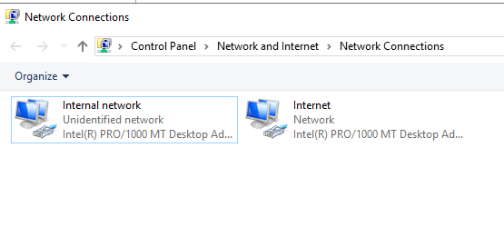
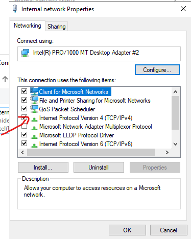
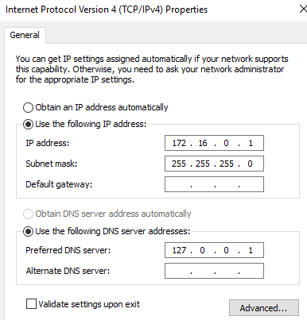
 
<ul>
  <li> For DNS you can either use the ip address of the external IP (the one that connects to ISP) or use the loopback address (127.0.0.1)
</ul>
 
 
<h3> Services and Configuration </h3>
<ul>
<li>The steps taken to install the services are the same as the ones we used to install Active Directory
</ul>
 
<ul>
  
   
  <li> **You may want to install theese services seprately **</li>
   
  
   
  <li> Make sure you add these features </li>
</ul>
 
 
<h4> DHCP Configuration</h4>
<ul> 
  <li> Once DHCP is install we can go to ->Tools->DHCP->rightcliick IPv4--> new scope
  <li> We will now add a Scope to our DHCP using the follwing illustrations</li>
   
   
  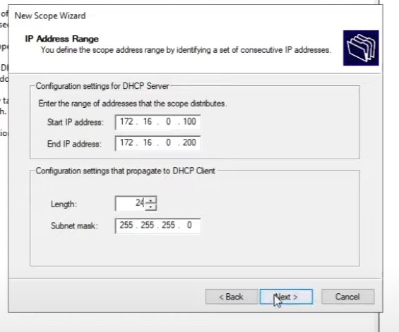
   
  <li> This is the address range we are using. We generate over a thousand users, so we are ussing a /24 meaning we only get 255 hosts per subnet. depending on the amount of host you need persubnett then you can adjust it to refelect needs.  
  <li> for the purpose of this assignment we will not exclude an address,but you can if needed: click Next
   
  
    
  <li>The address leasing time for the sake of this project will be 8 daysm, however depending on the buisiness needs and security measures it is better to reduce the lease time to a minimum of 12 hours. As this will ensure DHCP Scope will not be exhausted and improve security.</li>
  <li> in the Configure DCP Scope options, click yes and next. This is where we are going to indetify the "router" with the address 172.16.0.1 as our gateway address. The trafffic flow will be the follwoing. the connectng client packets will be sent to the gateway (172.16.0.1) to the loopback address (127.0.0.1), the loop back address is associated with external facing ip address that connects to my ISP (you can determine the ip by going to command pormpt and typing ipconfig /all)
  <li> The follwing page will be auto configured since Active directory automatically installs DNS just make sure that the parent domain is name after whatever you put for your domain controller and the IP address of the private network (172.16.0.1).</li>
  <li> After this click next on everything else that that should be it. and it should look more or less like the following. </li>
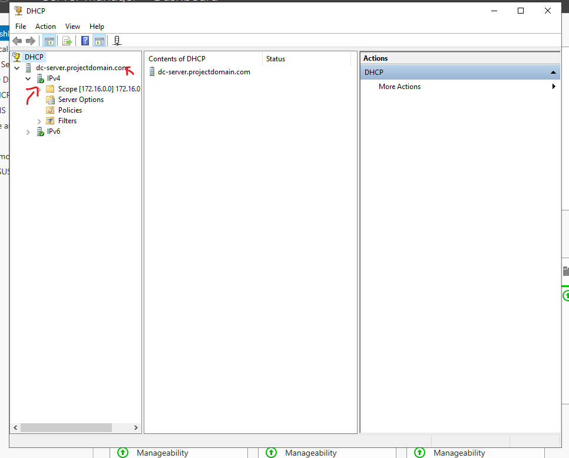
</ul>
 
 
<h3> Configuring RAS and NAT </h3>
 
This section is fairly quick, the services are installed all there is left to do is go to Tools-->Routing and Remote Access-->right click Server--> Configure and Enable--> NAT-->Select ISP interfac
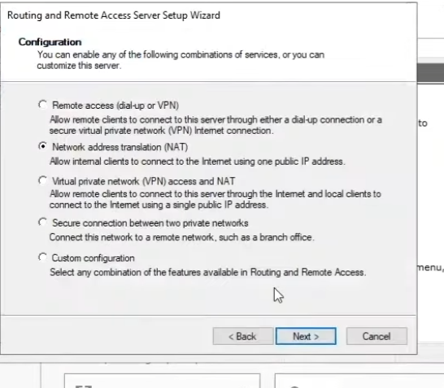
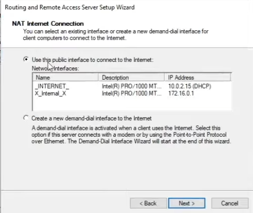
  
 
 
 
<h2 id="Pro">Windows Pro Client- Access Private Network @ Server</h2>
Now that we have our server configured, it is time to connect one of the generated users to the server and test for the following:
<ol>
  <li>IP address reflects the DHCP scope</li>
  <li>Test internet connectivity</li>
  <li>Check Domain is in accordance to Domain controller</li>
</ol>

<h3>Connecting to Domain Controller</h3>
<ul>    
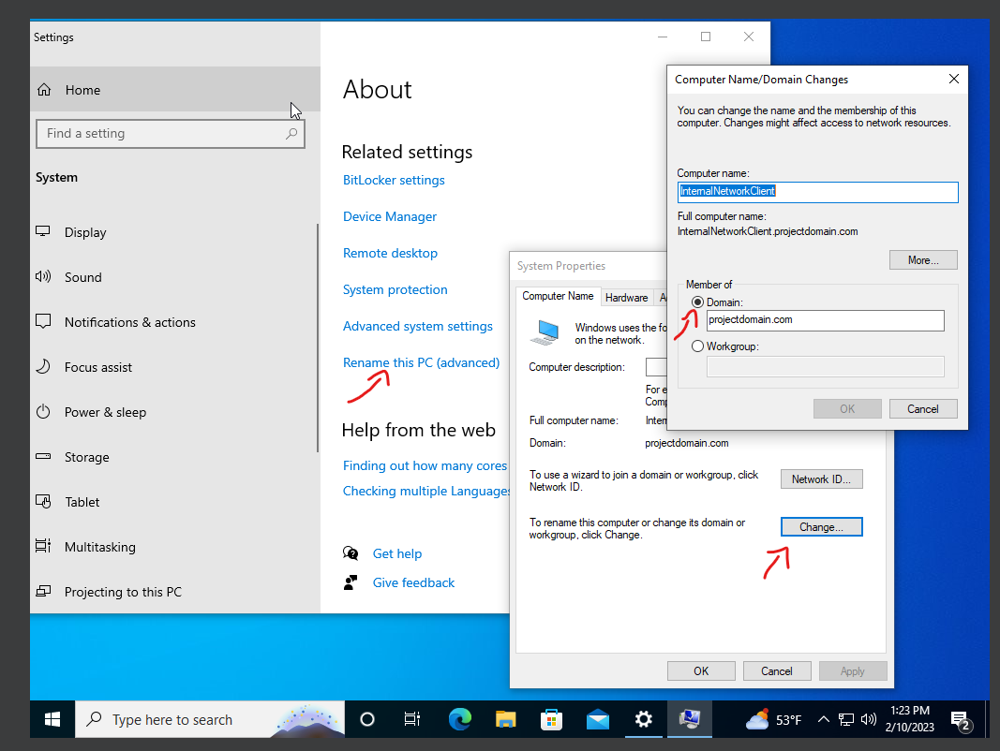
   
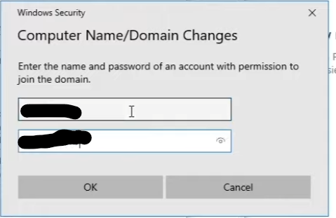
 
  <li> You wan to make sure you use the user name of on of the accounts you created from the User creation section. For this project all passwords should be Password1</li>
 
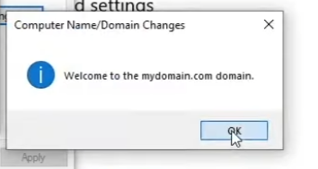
</ul>
<h3> Tests</h3>
<ul>
  <li>IP address reflects the DHCP scope</li>
   
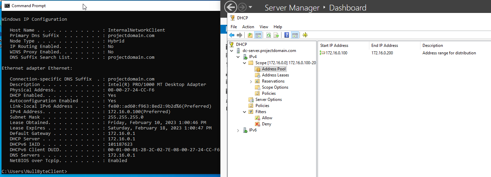
   
  <li> On the right side, we can see the Client image shows the ip address is 172.16.0.100 and it's Gateway is 172.16.0.1.</li>
  <li> On the left side, we can see the server image shows the current lease that matches the ip address of the client image.</li>
   
  <li>Test internet connectivity</li>
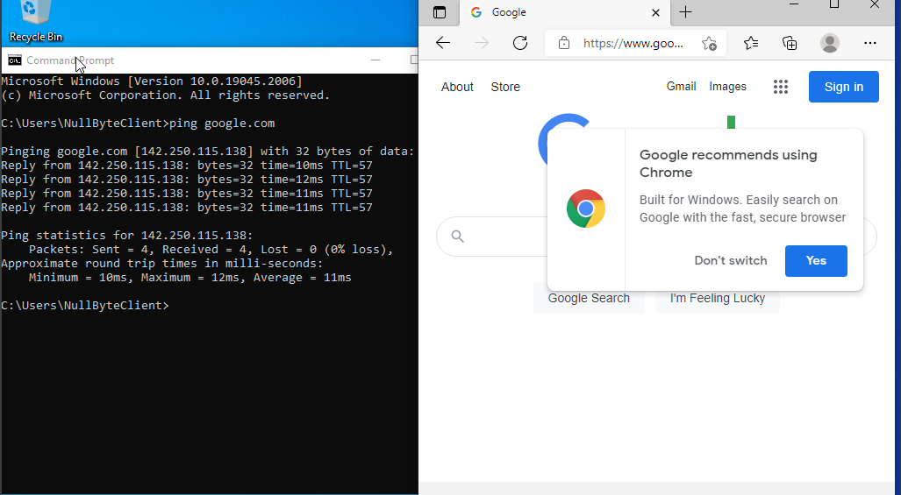
  <li>Here we can see that we were able to ping and reach Google.com
</ul>
 
 
 
<h2 id="Scale">Scaled Project</h2>
This project will be intergrated with other project such SIEM Monitoring and Windows Directory Privelage escalation. Please refer to the following links to see the continuation of this project.
 
- [SIEM Enviroment **in progress**](https://github.com/Nullbyted/SIEM_Enviroment)
 
- [Snort IDS/IPS Rules **in progress**](https://github.com/Nullbyted/Snort_IDS-IPS)
 
- [Sysmon **in progress**](https://github.com/Nullbyted/Sysmon)
 
- [Windows Privelage Escalation **in progress**](https://github.com/Nullbyted/WindowsPriveEsc)

    
    
    

 
  
  
  

