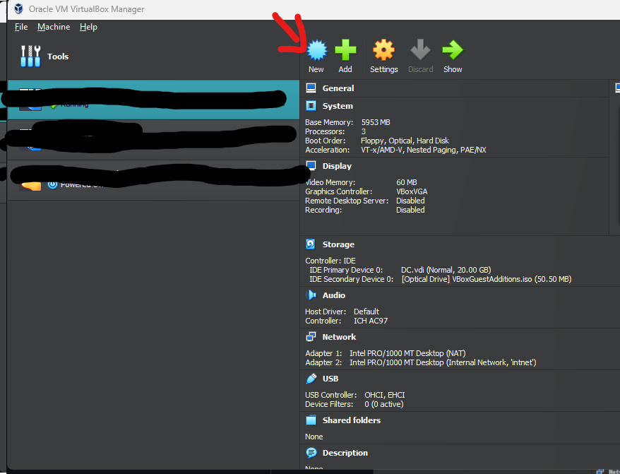
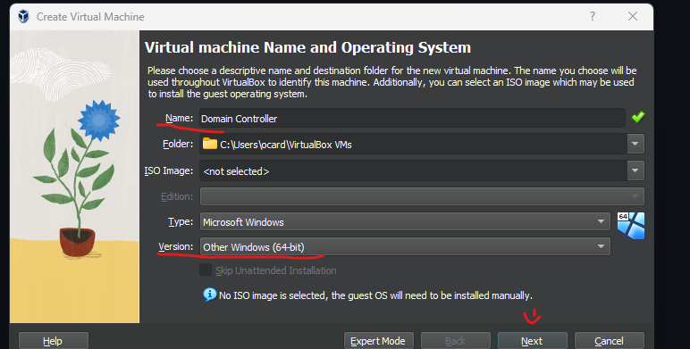
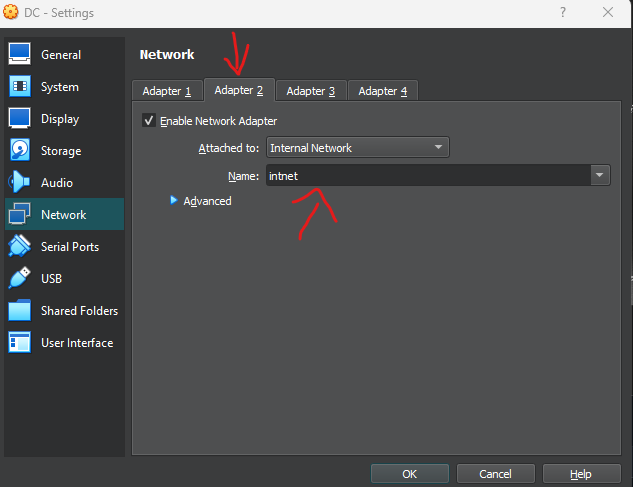
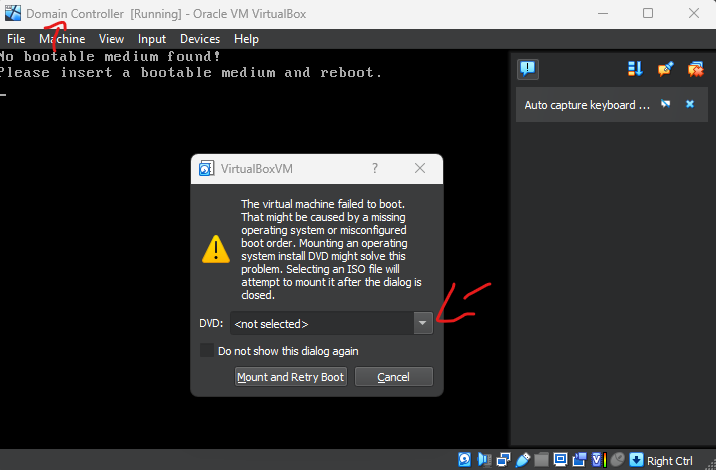

<h1> Active Directory Environment </h1>

<h2 style="text-align: center;">Objective: </h2>
  <ul style="font-size:10px">
      <li> Create Windows 2016 VM configured with private Network for clients </li>
      <li> Install Active Directory. </li>
      <li> Install DHCP and DNS Services for private network </li>
      <li> Install Remote Access Services </li>
      <li> Create OU's for admin and users using both GUI and powershell. *includes username paswwords </li>
      <li> Create Client (Windows Pro) to connect Domain Controller </li>
      <li> 
      <li> Install File and Printer Services </li>
  </ul>
  
<h3> - Windows 2016 VM with Virtual box </h3>
<ul>

  <li> The folowing step are based of what your computer can handle ** I have a high performance computer so my selection may not work with yours</li>
  <li> I did not add the Iso Image yet as we will do that on start up </li>
  <li> You shoul see "Domain Controler" on your Virtual Box- Select Settings/Network </li>

  <li>Enable a second adapter to be used by the Private network | The first adapter gives us internet to DC; the latter is the internal Network connectionn to DC</li>
  <li> Click OK and Start machine </li>
  

  <li> Select other and use Windows 2016 Iso file- Select- Mount and Retry Boot </li>
  
</ul>

