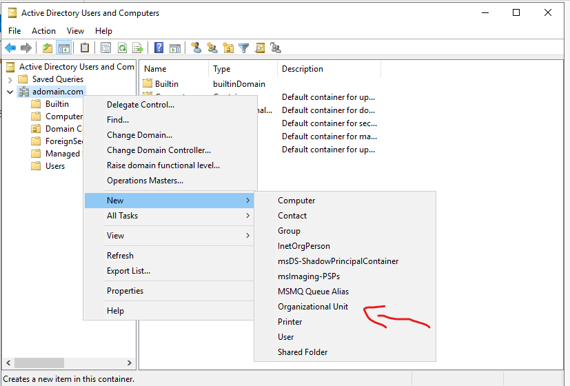
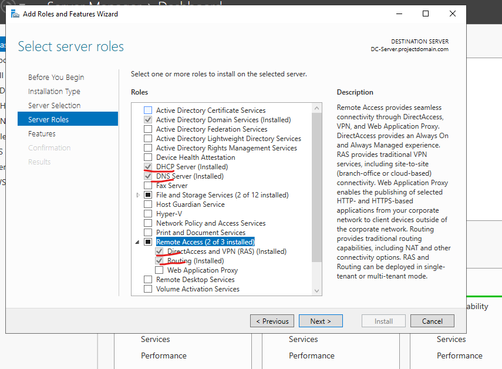

<h1 align="center"> Active Directory Environment</h1>

<h2 style="text-align: center;">Objective: </h2>

 
 
 
<h2> Table of Contents</h2>
  <ul style="font-size:10px">
      <li> Install Microsoft Server 2019 & Windows Pro (Virtual Box): *refer to InstallationGuide.md* </li>
      <li> Install Active Directory. </li>
      <li> </li>
      <li> Install DHCP and DNS Services for private network </li>
      <li> Install Remote Access Services </li>
      <li> Create OU's for admin and users using both GUI and powershell. *includes username paswwords </li>
      <li> Create Client (Windows Pro) to connect Domain Controller </li>
      <li> 
      <li> Install File and Printer Services </li>
  </ul>
 
 
<h2> Installing Active Directory </h2>
<ul>
  
  <li> Server Manager should automatically pop up. Click "Add roles and features"  </li>
  <li> at the Add roles window - click next until youu reach server roles and select "Active Directory Domain Services"  </li>
  <li> "Add Features"  </li>
  
  <li>Click "Next" and finsih installation  </li>
  <li> Follow the next pictures to AD post Deployment  </li>
   
   | 
  <li> After you hit next you will be prompted to add a password, then click next all the way through until you reach install  </li>
  <li> Your VM should automatically restart when finsihed </li>
</ul>
 
 
 
<h2> Active Directory User Creation Method 1 of 3</h2>
<ul>
  <li> Your Windows Server has now been promoted to a Domain Controller with the intallation of Active directory. </li>
  
  <li> As you can see Active Directory (AD) has been allocated to Server manager. </li>
  <li> For user creation; proceed with Active Directory Users and Computers </li>
   
  <li> We will start m=by making two Organizational Units (OU's) "adadmin" & "adusers" </li>
   |  | 
   
  <li> We will start by adding a user to "ADadmin". </li>
  <li> At the ADamin OU Right-click=>New=>User </li>
  
 
  <li> The same process applied can be used for the Users OU </li>
  <li> ***NOTE: The Password policy is set to never expires, in production you would want to add a strong password policy*** </li>
 
  <li> Now lets give the user in our ADadmin OU administrator priveleges </li>
  <li> at user Right-click=>Properties=>Member-of=>Add </li>
  
  <li> Now you sign out of the administrator account and login with the admin account you created </li>
</ul>
 
 
 
<h2> Active Directory User Creation Method 2 of 3</h2>
<ul>
  <li>In this method we will use Power shell to create a user </li>
   |  | 
</ul>
 
 
 
<h2> Active Directory User Creation Method 3 of 3</h2>
 
</ul>
  <li> The last method is Automation with a Powershell Script </li>
  <li> This is geared towards an onboarding batch of more that 60 agents. Single agent creation will most likely be done through AD users and computers
  <li> Anywyas i will provide two script: First one is a non-secured script based of Jogn Matador. The second one is one that i made that is rudimental in nature but with no regard a more secure method of user creation.</li>
 
<h4> - Unsecure script </h4>
<pre>
$PASSWORD_FOR_USERS   = "Password1"
$USER_FIRST_LAST_LIST = Get-Content .\names.txt

$password = ConvertTo-SecureString $PASSWORD_FOR_USERS -AsPlainText -Force
New-ADOrganizationalUnit -Name ADUSERS -ProtectedFromAccidentalDeletion $false

foreach ($n in $USER_FIRST_LAST_LIST) {
    $first = $n.Split(" ")[0].ToLower()
    $last = $n.Split(" ")[1].ToLower()
    $title = $n.split(" ")[2].ToLower()
    $email = $n.split(" ")]3].ToLower()
    $username = "$($first.Substring(0,1))$($last)".ToLower()
    Write-Host "Creating user: $($username)" -BackgroundColor Black -ForegroundColor red
    
    New-AdUser -AccountPassword $password `
               -GivenName $first `
               -Surname $last `
               -DisplayName $username `
               -Name $username `
               -EmployeeID $username `
               -Email $email `
               -PasswordNeverExpires $true `
               -Path "ou=_USERS,$(([ADSI]`"").distinguishedName)" `
               -Enabled $true
}
</pre>
<h5>Analysis: </h5>
As we can see this string is not a secure method for user creation, but it works for this lab enviroment. Some of the flaws we can observe are:
<ol>
  <li> The variable "PASSWORD_FOR_USERS" is using the easiest password possible </li>
  <li> On the same password we are forcing this password as plain text </li>
  <li> The script created a new OU, but it was assigned the boolean False </li>
  <li> The script fills in all the attributes but all of them are using the username </li>
  <li> Password policy is set to never expire </li>
</ol>
 
All of these features are easily exploitable in production and should only be used to prove automation with powershell

<h4> Rudimental Secure script </h4>
 
<pre>
$filePath = Read-Host "Enter the path of the input file"
$defaultPassword = ConvertTo-SecureString "Password1" -AsPlainText -Force

$users = Get-Content $filePath

foreach ($user in $users) {
  $username = $user.Split(",")[0]
  $firstName = $user.Split(",")[1]
  $lastName = $user.Split(",")[2]
  $email = "$username@yourdomain.com"

  New-ADUser -Name "$firstName $lastName" -GivenName $firstName -Surname $lastName -UserPrincipalName $email -EmailAddress $email 
  -AccountPassword $defaultPassword -Enabled $true -ChangePasswordAtLogon $true -PasswordNeverExpires $false 
  -MaxPasswordAge "90.00:00:00" -Path "OU=Users,DC=yourdomain,DC=com"
}

Write-Host "User accounts created successfully."

</pre>
<h5>Analysis: </h5>
This script is rudimental in nature but it has some features worth metioning:
<ol>
  <li> The Password is set to "Password1" however the script forces the user to create a new one after firest login </li>
  <li> Password policy, as mentioned, makes the user change it after login and has a 90 day expire with no password recycling </li>
  <li> Script ensures that all attributes are distinct and must appear in the file where the names reside </li>
</ol>

Overall execcution will yeild these results:

  
  
  
<h2> Install DHCP, DNS, & RAS- Private Network </h2>

This section we will install the aformentioned services to provide a way for remote clients to access the server. In essence, the client will get WAN connection from the server to mimic a corporate enviroment.

The steps taken to install the services are the same as the ones we used to install Active Directory but we will install these:

<ul>
  <li> DHCP- will allow for autmatic IPv4 assignment to any connection clients </li>
  <li> DNS- allows proper domain resolution when client access WAN </li>
  <li> RAS- actually allows the client to connect to the server

  
 
  
  
  

