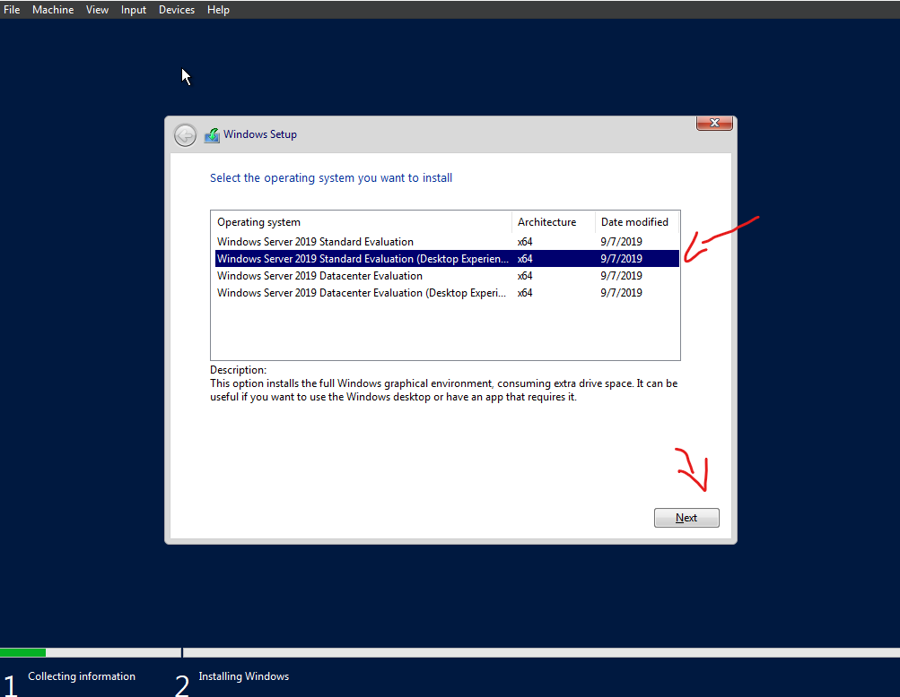

<h1> Active Directory Environment</h1>

<h2 style="text-align: center;">Objective: </h2>
  <ul style="font-size:10px">
      <li> Create Windows 2016 VM configured with private Network for clients </li>
      <li> Install Active Directory. </li>
      <li> Install DHCP and DNS Services for private network </li>
      <li> Install Remote Access Services </li>
      <li> Create OU's for admin and users using both GUI and powershell. *includes username paswwords </li>
      <li> Create Client (Windows Pro) to connect Domain Controller </li>
      <li> 
      <li> Install File and Printer Services </li>
  </ul>
<h2> Click Here to skip installation guide ****** </h3>
 
<h3> - Windows Server 2019 VM with Virtual box </h3>
<ul>

  <li> The folowing step are based of what your computer can handle ** I have a high performance computer so my selection may not work with yours</li>
  <li> I did not add the Iso Image yet as we will do that on start up </li>
  <li> You shoul see "Domain Controler" on your Virtual Box- Select Settings/Network </li>

  <li>Enable a second adapter to be used by the Private network | The first adapter gives us internet to DC; the latter is the internal Network connectionn to DC</li>
  <li> Click OK and Start machine </li>
  

  <li> Select other and use Windows 2016 Iso file- Select- Mount and Retry Boot </li>
  
 | | 
 
  <li> Add a Pasword, Finish and Login </li>
</ul>
 
 
 
<h2> Installing Active Directory </h2>
<ul>
  
  <li> Server Manager should automatically pop up. Click "Add roles and features"  </li>
  <li> at the Add roles window - click next until youu reach server roles and select "Active Directory Domain Services"  </li>
  <li> "Add Features"  </li>
  
  <li>Click "Next" and finsih installation  </li>
  <li> Follow the next pictures to AD post Deployment  </li>
   
   | 
  <li> After you hit next you will be prompted to add a password, then click next all the way through until you reach install  </li>
  <li> Your VM should automatically restart when finsihed </li>
</ul>
 
 
 
<h2> Active Directory User Creation Method 1 of 3</h2>
<ul>
  <li> Your Windows Server has now been promoted to a Domain Controller with the intallation of Active directory. </li>
  
  <li> As you can see Active Directory (AD) has been allocated to Server manager. </li>
  <li> For user creation; proceed with Active Directory Users and Computers </li>
   
  <li> We will start m=by making two Organizational Units (OU's) "adadmin" & "adusers" </li>
   |  | 
   
  <li> We will start by adding a user to "ADadmin". </li>
  <li> At the ADamin OU Right-click=>New=>User </li>
  
 
  <li> The same process applied can be used for the Users OU </li>
  <li> ***NOTE: The Password policy is set to never expires, in production you would want to add a strong password policy*** </li>
 
  <li> Now lets give the user in our ADadmin OU administrator priveleges </li>
  <li> at user Right-click=>Properties=>Member-of=>Add </li>
  
  <li> Now you sign out of the administrator account and login with the admin account you created </li>
</ul>
 
 
 
<h2> Active Directory User Creation Method 2 of 3</h2>
<ul>
  <li>In this method we will use Power shell to create a user </li>
   |  | 
</ul>
 
 
 
<h2> Active Directory User Creation Method 3 of 3</h2>

  
  

  
 
  
  
  

